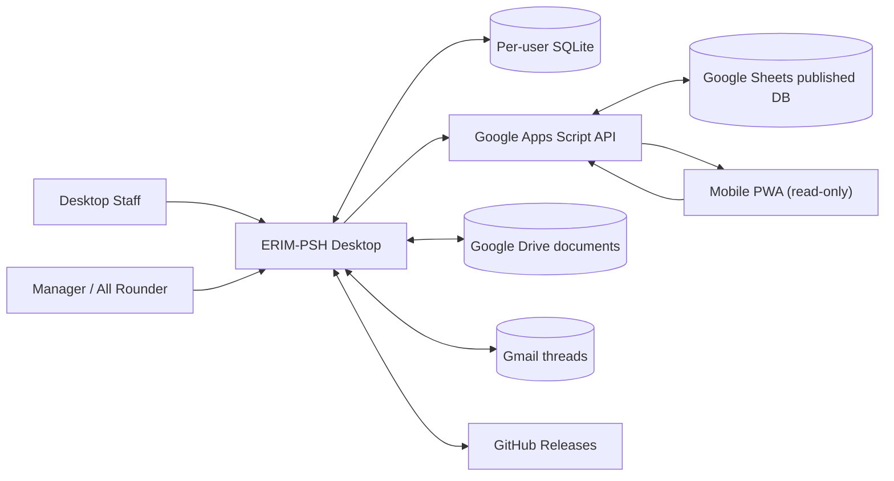
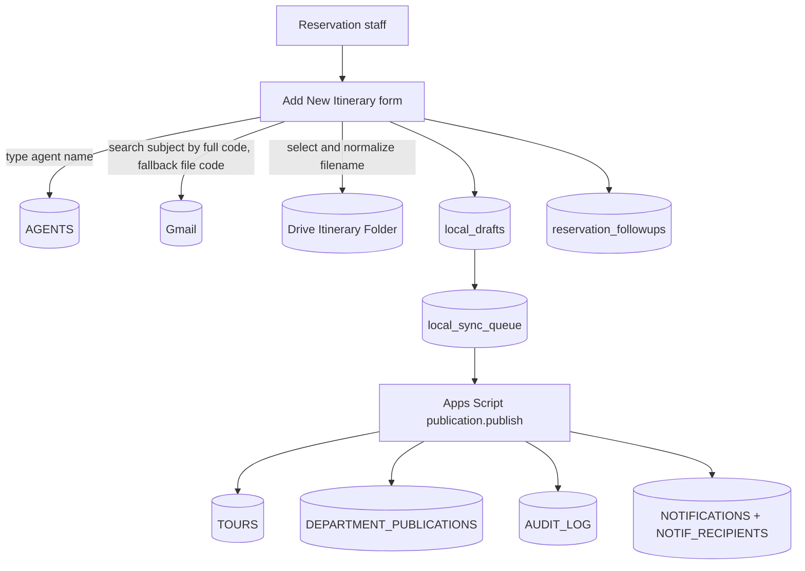
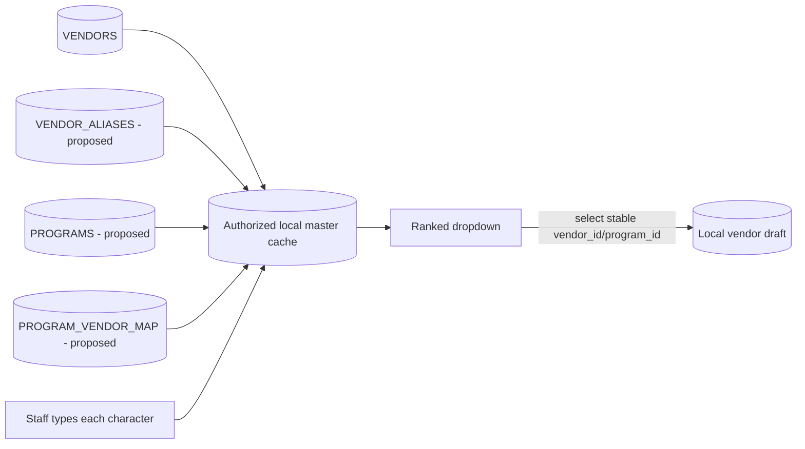
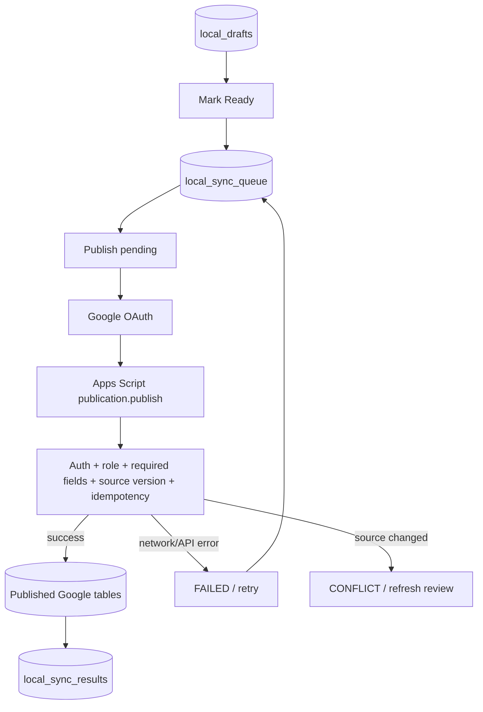

# ERIM-PSH — Detailed Function, Process, and Data Flow Design

Document status: `BASELINE FOR REVIEW`
Prepared: 2026-07-27
Scope: Desktop operations, Google connections, local SQLite, Apps Script,
Google Sheets, Google Drive, Gmail, updater, and planned department modules.

---

## 1. Purpose and notation

Dokumen ini menjadi dasar pembuatan DFD rinci dan daftar fungsi ERIM-PSH.
Urutan pembahasan mengikuti posisi aplikasi:

1. Settings dan koneksi di bagian atas.
2. Shared/system functions.
3. Menu dan tombol per department.
4. Aliran data lokal dan online.
5. Tabel Google Sheet yang dibaca atau ditulis.
6. Google Drive/Gmail reference yang terkait.
7. Gap dan keputusan yang wajib diselesaikan sebelum implementasi berikutnya.

Status:

- `[I] IMPLEMENTED`: fungsi sudah terdapat di aplikasi/kode sekarang.
- `[F] FOUNDATION`: tabel atau fondasi sudah tersedia, tetapi workflow belum lengkap.
- `[P] PLANNED`: keputusan sudah dicatat untuk pengembangan berikutnya.
- `[G] GAP`: kontrak/data/function perlu diselaraskan sebelum dianggap aman.

Prinsip data:

- Local SQLite adalah temporary workspace per user.
- Google Sheet adalah published operational database.
- Google Drive adalah authoritative document/evidence storage.
- Gmail adalah authoritative communication thread.
- Apps Script harus menjadi gateway resmi untuk mutation online.
- Mobile hanya membaca published data.
- Detail organik tetap diisi manusia; sistem membantu konteks, pencarian,
  koordinasi, validasi, status, dan audit.

---

## 2. DFD Level 0 — System context



### Authority boundary

```text
User input
  -> Desktop validation
    -> Local draft/snapshot
      -> Complete / Post / Confirm action
        -> Apps Script authentication + permission + version check
          -> Published Google tables + Drive/Gmail references + AUDIT_LOG
            -> Notification/work item to downstream department
```

Tidak boleh:

```text
PC Staff A local database -> dibaca langsung PC Staff B
Local file path C:\...     -> dijadikan official shared document link
Mobile                     -> melakukan mutation
Generated email preview    -> dianggap SENT
Email reply received       -> otomatis dianggap CONFIRMED tanpa review manusia
```

---

## 3. Data stores

### 3.1 Local SQLite `[I]`

```text
app_settings
  Identitas lokal, environment, endpoint, dan Google resource IDs.

local_drafts
  Draft kerja department yang belum menjadi official publication.

local_source_snapshots
  Snapshot immutable dari source publication yang menjadi dasar pekerjaan.

local_generated_files
  File/package yang dibuat lokal dan status upload-nya.

local_sync_queue
  Antrean publication dengan idempotency key dan retry state.

local_sync_results
  Hasil publication yang dikembalikan server.

local_activity_log
  Audit lokal untuk aktivitas desktop.

reservation_followups
  Pending KPI/follow-up Reservation pada PC staff.
```

### 3.2 Google Sheets published database `[F]`

Workbook foundation mempunyai 35 tab. Tiga puluh satu tab merupakan tabel
operasional/master; sisanya README, DATA_DICTIONARY, STATUS_CATALOG, dan
SHEET_INDEX.

### 3.3 Google Drive `[I/F]`

```text
ERIM-PSH - ITINERARIES
  Current itinerary file menggunakan stable Drive File ID.
  Revision mengganti content file yang sama dan mempertahankan Drive revision.

Future folders
  Booking Packages
  Vendor Evidence
  Quotations
  Customer Invoices
  Transport Invoices
  TOC Supporting Files
  Payment Proof
  Reports / Exports
```

### 3.4 Gmail `[I/F]`

Gmail menyimpan communication content. Google Sheet hanya menyimpan stable
reference dan snapshot yang diperlukan untuk audit:

- thread ID;
- message ID;
- sender/recipient snapshot;
- subject/body snapshot untuk sent communication;
- attachment Drive file IDs;
- sent/reply/confirmation timestamps;
- review/open audit.

---

## 4. Function tree — Settings and connections

```text
0. SETTINGS & CONNECTIONS
  0.1 Desktop Bootstrap [I]
    0.1.1 Open local SQLite
    0.1.2 Run schema migration
    0.1.3 Load public settings
    0.1.4 Load dashboard counts
    0.1.5 Load Google auth status
    0.1.6 Load local work queues
    0.1.7 Start updater check

  0.2 Save Settings [I]
    0.2.1 Employee ID
    0.2.2 Employee Name
    0.2.3 Department
    0.2.4 Environment
    0.2.5 Apps Script API URL
    0.2.6 Google OAuth Client ID
    0.2.7 Legacy Client Secret
    0.2.8 Google Spreadsheet ID
    0.2.9 Google Drive Folder ID

  0.3 Google Connection [I]
    0.3.1 Connect Google
    0.3.2 OAuth browser authorization
    0.3.3 Loopback callback
    0.3.4 Secure local session storage
    0.3.5 Refresh access token
    0.3.6 Disconnect Google

  0.4 Backend Connection Console [I]
    0.4.1 Local SQLite health
    0.4.2 Dummy publication engine
    0.4.3 Google account
    0.4.4 Gmail API
    0.4.5 Drive API/folder
    0.4.6 Sheets API/workbook
    0.4.7 Apps Script deployment
    0.4.8 GitHub repository
    0.4.9 Application updater

  0.5 Application Updater [I]
    0.5.1 Check update
    0.5.2 Download update
    0.5.3 Restart and install
```

### 4.1 Settings process specification

| Process | Actor | Input | Local read/write | Online read/write | Output / note |
| --- | --- | --- | --- | --- | --- |
| Desktop Bootstrap | Every desktop user | Application start | Reads/writes SQLite schema; reads `app_settings`, local queues, local dashboard | No required online write | Application opens even when Google is offline. |
| Save Settings | User; production fields should later be Admin-controlled | Form fields | Writes `app_settings`; appends `local_activity_log: SETTINGS_UPDATED` | None | Saving an ID does not prove the resource is reachable. |
| Connect Google | User | OAuth Client ID and consent | Writes encrypted session file; does not store token in Sheets | Google OAuth/token endpoints | Official identity is still resolved server-side from `EMPLOYEES`. |
| Disconnect Google | User | Button action | Deletes/clears local OAuth session | May revoke later; current flow clears local session | Does not delete business records. |
| Run All Checks | Admin/authorized DEV user | Current settings | Reads SQLite counts | Read-only calls to Gmail, Drive, Sheets, Apps Script, GitHub | Must not create or modify business data. |
| Check/Download/Install Update | User | Current version | Uses installed app metadata | Reads GitHub Release feed | Draft data remains in application user-data folder. |

### 4.2 Environment behavior

```text
DEV
  Publish pending -> local dummy result only.
  No official Sheet mutation.

ADMIN_DEV
  Uses real Google connector and Apps Script with dummy/test data.
  Previously completed LOCAL_DUMMY jobs are re-queued for online test.

STAGING
  Production-like schema and controlled test users.

PROD
  Company Workspace, approved recipients, company-owned deployment and Drive.
```

### 4.3 Connection configuration ownership

| Setting | Stored locally | Server counterpart | Security note |
| --- | --- | --- | --- |
| Employee ID/name/department | `app_settings` | `EMPLOYEES` | Local value is display/workspace context only. Server identity wins. |
| Environment | `app_settings` | `CONFIG`/deployment | PROD selection must not bypass server environment. |
| Apps Script URL | `app_settings` | Deployment URL | Must end at approved `/exec`. |
| OAuth Client ID | `app_settings` | `GOOGLE_CLIENT_ID` Script Property | Audience must match server validation. |
| OAuth secret | Local only, legacy | Not required for PKCE desktop flow | Must never enter Sheet, draft, log, or repository. |
| Spreadsheet ID | `app_settings` | `SPREADSHEET_ID` Script Property | Both must reference the same environment. |
| Drive folder ID | `app_settings` | Future `CONFIG`/server policy | Upload must reject missing official folder. |

---

## 5. Function tree — Current menu and button layout

```text
1. DASHBOARD
  1.1 Inbox [I]
    1.1.1 Load notifications
    1.1.2 Open notification action target
  1.2 Reservation pending follow-up [I]
    1.2.1 Save pending reason
    1.2.2 Resolve follow-up
  1.3 Shared Department Workspace [I]
    1.3.1 New department draft
    1.3.2 Save local draft
    1.3.3 Edit local draft
    1.3.4 Mark Ready
    1.3.5 Queue
    1.3.6 Cancel with mandatory reason

2. RESERVATION [I/F]
  2.1 Add New Itinerary
    2.1.1 Customer Code normalization
    2.1.2 Agent autocomplete
    2.1.3 Add unregistered agent flag
    2.1.4 Search confirmation Gmail
    2.1.5 Select confirmation thread
    2.1.6 Load email trail
    2.1.7 Post soft-copy itinerary to Drive
    2.1.8 Create local draft and KPI follow-up
    2.1.9 Mark Ready
    2.1.10 Queue for publication
    2.1.11 Publish through Sync Center

  2.2 Revise Itinerary
    2.2.1 Find Customer Code
    2.2.2 Load TOURS + TOUR_DAYS + revision history
    2.2.3 Load latest DOCX content from Drive
    2.2.4 Choose mandatory revised DOCX
    2.2.5 Enter mandatory revision note
    2.2.6 Post Drive revision
    2.2.7 Append revision record
    2.2.8 Append audit and broadcast notification
    2.2.9 Start Reservation follow-up

  2.3 Re Check Itinerary
    2.3.1 Find record
    2.3.2 View Gmail trail
    2.3.3 View daywise
    2.3.4 View current Drive DOCX
    2.3.5 View append-only logbook
    2.3.6 Download latest itinerary
    2.3.7 Open download folder

  2.4 Cek KPI
    2.4.1 Personal totals
    2.4.2 Pending detail
    2.4.3 Pending reason and waiting department
    2.4.4 Resolution age

3. VENDOR BOOKING [F/P]
  3.1 Daily Inbox and Claim
  3.2 New Confirmation
  3.3 Revised Confirmation
  3.4 Universal Lookup
  3.5 Daywise and micro-item split
  3.6 Supplier booking generation
  3.7 Email / WhatsApp / Portal action
  3.8 Per-micro-item review and confirmation
  3.9 Booking Complete publication

4. TRANSPORT [F/P]
  4.1 Daywise transport queue
  4.2 Driver/transporter assignment
  4.3 Effective rate lookup
  4.4 TOC preparation
  4.5 Transport invoice checking

5. OPS ACCOUNTING [F/P]
  5.1 Quotation linkage
  5.2 Customer invoice
  5.3 Cost/reconciliation
  5.4 Payment request

6. GENERAL CASHIER [F/P]
  6.1 Payment request review
  6.2 Return/reject
  6.3 Execute payment
  6.4 Upload proof
  6.5 Mark Paid

7. MANAGER / ADMIN [F/P]
  7.1 Master data
  7.2 Roles and permissions
  7.3 Exceptions/takeover
  7.4 KPI and audit
  7.5 Templates and status catalog

8. SYNC CENTER [I]
  8.1 View queue
  8.2 Publish pending
  8.3 Retry failed
  8.4 Review version conflict

9. ADMIN DEV CONSOLE [I]
  9.1 Run all connection checks

10. SETTINGS [I]
  10.1 Save desktop settings

11. TOP BAR [I]
  11.1 Connect/Disconnect Google
  11.2 Check/Download/Install update
```

---

## 6. Shared Department Workspace data flow

```text
New Department Draft [I]
  Actor:
    Current department staff.
  Input:
    Customer Code, department, work type, title, details,
    optional confirmation/quotation URL, booking channel,
    external reference, source publication ID/version.
  Local writes:
    local_drafts
    local_activity_log: DRAFT_CREATED.
  Online writes:
    None.

Edit [I]
  Allowed:
    LOCAL_DRAFT before READY_TO_POST/POSTING/SYNCED.
  Local writes:
    local_drafts, increment local_revision
    local_activity_log: DRAFT_UPDATED.
  Guard:
    Posted work requires a controlled revision, not silent editing.

Mark Ready [I]
  Validation:
    Customer Code, title, and non-empty payload.
  Local writes:
    local_status = READY_TO_POST
    sync_status = READY_TO_QUEUE
    local_activity_log: DRAFT_MARKED_READY.
  Online writes:
    None.

Queue [I]
  Precondition:
    local_status = READY_TO_POST.
  Local writes:
    local_sync_queue with operation PUBLICATION_PUBLISH
    local_drafts.sync_status = PENDING_SYNC
    local_activity_log: SYNC_QUEUED.
  Important:
    Stable idempotency key is retained for retry.

Cancel [I/F]
  Precondition:
    Draft has not been SYNCED.
  Required:
    Cancellation reason.
  Local writes:
    local_status/sync_status = CANCELED
    cancel_reason
    local_activity_log: DRAFT_CANCELED.
  UI note:
    Database function exists; a dedicated visible Cancel control should be
    verified/added per department workflow.
```

---

## 7. Detailed Reservation data flow

### 7.1 Add New Itinerary



#### Function details

```text
2.1.1 Customer Code normalization [I]
  Input:
    ND/PSHBALI5489
  Derived:
    sales_code = ND
    file_code = PSHBALI5489
    filename_code = ND-PSHBALI5489
  Rule:
    Slash remains in system/email search.
    Slash becomes hyphen only for Windows/Drive filename.

2.1.2 Agent autocomplete [I/G]
  Trigger:
    Each input character.
  Current source:
    AGENTS!A2:M.
  Current filter:
    Active name contains typed text; maximum eight results.
  Planned generalization:
    Universal Lookup with prefix/exact/program relevance ranking and keyboard controls.
  Gap:
    AGENTS is used by code but is not present in the 35-tab foundation workbook.

2.1.3 Add unregistered agent [I/F]
  Result:
    agentRegistrationRequired = true in local draft payload.
  Required future process:
    Create Manager/Admin review work item before AGENTS master mutation.

2.1.4 Search confirmation email [I]
  Query 1:
    Gmail subject:"ND/PSHBALI5489".
  Fallback:
    Gmail subject:"PSHBALI5489".
  Display:
    Subject, sender, date; staff chooses the correct thread.
  Write:
    No Gmail/Sheet write during search.

2.1.5 Post Soft Copy Itinerary [I]
  Input:
    File chosen from My Computer.
  Validation:
    Customer Code, customer name, official Drive Folder ID.
  Rename:
    {filename_code} - {customer_name}.{extension}
  Drive:
    Creates a file inside configured itinerary folder.
  Form result:
    driveFileId, driveFileName, driveFileUrl.

2.1.6 Submit Add New Itinerary [I]
  Local writes:
    local_drafts
    local_activity_log
    reservation_followups
  Draft payload:
    customerName, salesCode, fileCode, agentId/name,
    agentRegistrationRequired, confirmation message/thread/subject,
    itinerary Drive file ID/name/URL.
  Important:
    Form submission creates a local draft; it is not yet an official publication.

2.1.7 Mark Ready -> Queue -> Publish [I]
  Local transitions:
    LOCAL_DRAFT
      -> READY_TO_POST / READY_TO_QUEUE
      -> PENDING_SYNC
      -> POSTING
      -> SYNCED | FAILED | CONFLICT
  Online action:
    publication.publish.
  Online writes for NEW_CONFIRMATION:
    TOURS
    DEPARTMENT_PUBLICATIONS
    AUDIT_LOG
    NOTIFICATIONS
    NOTIF_RECIPIENTS
    PUBLICATION_LINKS only when an upstream source exists.
```

### 7.2 Revise Itinerary

```text
2.2.1 Find record [I]
  Reads:
    TOURS
    TOUR_DAYS
    ITINERARY_REVISIONS
    local_drafts fallback
    Drive metadata/content
  Result:
    customer, tour ID/status, current revision, daywise,
    Drive File ID/name/link, scrollable DOCX HTML.

2.2.2 Choose revised DOCX [I]
  Local:
    File picker accepts .docx only.
  Write:
    No online write until Post.

2.2.3 Post revision [I/G]
  Required:
    Customer Code, existing Drive File ID, revised DOCX, revision note.
  Drive write:
    PATCH content to the same stable Drive File ID.
    keepRevisionForever = true.
  Sheet write:
    Append ITINERARY_REVISIONS.
  Apps Script event:
    itinerary.event, eventType = REVISION.
  Apps Script writes:
    AUDIT_LOG
    NOTIFICATIONS
    NOTIF_RECIPIENTS
  Local write:
    reservation_followups.
  Gap:
    ITINERARY_REVISIONS is currently appended directly through Sheets API.
    It must move behind Apps Script before PROD.
```

### 7.3 Re Check Itinerary

```text
2.3.1 Find record [I]
  Reads:
    TOURS
    TOUR_DAYS
    ITINERARY_REVISIONS
    EMPLOYEES
    AUDIT_LOG
    Gmail search
    Drive metadata/content
  Displays:
    Left = connected confirmation email list/trail.
    Middle = daywise and status.
    Right = current Drive DOCX content.
    Bottom = append-only itinerary logbook.

2.3.2 Open email trail [I/G]
  Reads:
    Gmail thread full messages.
  Displays:
    sender, to, cc, subject, date, sanitized body, attachment names.
  Gap:
    Current GET does not explicitly remove Gmail UNREAD label.
    Required future action:
      mark read only in the current staff mailbox;
      append EMAIL_REVIEW_OPENED to AUDIT_LOG even if status is unchanged.

2.3.3 Download Latest Itinerary [I]
  Reads:
    Drive current file by stable ID.
  Local write:
    Downloads\ERIM-PSH\Itineraries\...
  Apps Script event:
    itinerary.event, eventType = DOWNLOAD.
  Online write:
    AUDIT_LOG only; no broadcast notification for download.

2.3.4 Open Download Folder [I]
  Local operation only.
  No Sheet/Drive/Gmail mutation.
```

### 7.4 Reservation KPI

```text
2.4.1 Start Follow-up [I]
  Trigger:
    Add New Itinerary or posted revision.
  Local write:
    reservation_followups with status PENDING and started_at.

2.4.2 Save Pending Reason [I]
  Required while PENDING:
    pending_reason.
  Optional/context:
    waiting_for_department.
  Local writes:
    reservation_followups
    local_activity_log.

2.4.3 Resolve Follow-up [I]
  Local writes:
    status = RESOLVED
    resolved_at
    local_activity_log.

2.4.4 Cloud KPI [F/G]
  Prepared tabs:
    RESERVATION_KPI
    RESERVATION_KPI_SUMMARY.
  Prepared function:
    syncReservationKpi.
  Current UI status:
    Local KPI screen is active, but cloud upsert is not called from the
    Save/Resolve handlers.
  Required final direction:
    Send KPI mutations through Apps Script, not direct Sheets API.
```

---

## 8. Detailed Vendor Booking development flow

### 8.1 Vendor module hierarchy

```text
3. VENDOR BOOKING
  3.1 Daily Inbox [P]
    3.1.1 New Itinerary received
    3.1.2 Revised Itinerary received
    3.1.3 Review reply received
    3.1.4 Booking Complete/final handoff
    3.1.5 Claim item
    3.1.6 Release claim
    3.1.7 Finish claim
    3.1.8 Manager takeover

  3.2 New Confirmation [P]
    3.2.1 Open exact Reservation publication
    3.2.2 View confirmation email + itinerary
    3.2.3 Create daywise
    3.2.4 Split daywise into micro services
    3.2.5 Assign vendor/program/channel
    3.2.6 Group services into supplier bookings
    3.2.7 Generate and preview communication
    3.2.8 Send/record communication
    3.2.9 Re-check per micro item

  3.3 Revised Confirmation [P]
    3.3.1 Compare old/new itinerary revision
    3.3.2 Classify each affected micro item
      UNCHANGED
      ADD
      CHANGE
      REBOOK
      CANCEL
    3.3.3 Require human decision and note
    3.3.4 Generate new/amend/cancel booking action
    3.3.5 Re-check affected item

  3.4 Universal Lookup [P]
    3.4.1 Vendor lookup
    3.4.2 Program/activity lookup
    3.4.3 Alias resolution
    3.4.4 Contextual ranking
    3.4.5 Keyboard navigation
    3.4.6 Show all fallback

  3.5 Micro-item Confirmation [P]
    3.5.1 Open linked Gmail/WhatsApp/portal evidence
    3.5.2 Append EMAIL_REVIEW_OPENED/review attempt
    3.5.3 CONFIRMED
    3.5.4 NOT_CONFIRMED + mandatory reason
    3.5.5 REVIEW_AGAIN
    3.5.6 CANCELED
    3.5.7 Completion gate
```

### 8.2 Universal Lookup data flow



Lookup rules:

1. Search occurs locally against the last authorized master snapshot so every
   keystroke does not call Google Sheets.
2. Exact match ranks first.
3. Prefix match ranks above contains match.
4. Vendor matching the selected program ranks above unrelated vendors.
5. Active and approved vendor ranks above inactive/historical aliases.
6. Frequently used vendor may break ties but may not override program rules.
7. Arrow Up/Down moves selection; Enter confirms; Escape closes.
8. `Show all vendors` is available to authorized staff.
9. Stored value is `vendor_id`; displayed label may change safely.
10. Alias suggestion must not silently overwrite intentional staff choice.

### 8.3 Organic-first booking detail

```text
System may prepare:
  Customer Code
  Tour/day/service IDs
  Day number and service date
  Hotel/location context
  Suggested program/vendor
  Pax
  Source itinerary revision

Staff remains authoritative for:
  "02 HRS SPA 13.00"
  pickup/drop detail
  special request
  exact vendor/program choice
  channel choice
  booking note
  reply interpretation
  confirmed/not-confirmed/cancel decision
```

### 8.4 Vendor table flow by process

| Vendor process | Read tables | Local work | Published writes | External store |
| --- | --- | --- | --- | --- |
| Daily Inbox | `WORK_ITEMS`, `NOTIFICATIONS`, `NOTIF_RECIPIENTS`, `TOURS` | Local inbox/cache | Claim state to `WORK_ITEMS`; audit to `AUDIT_LOG` | None |
| Load New Confirmation | `TOURS`, `ITINERARY_REVISIONS`, `DEPARTMENT_PUBLICATIONS`, `PUBLICATION_LINKS` | `local_source_snapshots`, `local_drafts` | None until Post | Drive itinerary; Gmail confirmation |
| Daywise split | Source publication, `VENDORS`, program mappings | Draft day/service/micro items | `TOUR_DAYS`, `SERVICES` after Post | None |
| Supplier grouping | `SERVICES`, `VENDORS` | Draft supplier packages | `SUPPLIER_BOOKINGS`, `BOOKING_SERVICES` | None |
| Generate communication | Supplier booking, contacts, template/SOP | `local_generated_files` and exact preview | `COMMUNICATIONS` status `GENERATED/REVIEWED` only after controlled post | Draft attachment files |
| Send by Gmail | Booking + approved To/CC | Sent result cache | `COMMUNICATIONS`, `SUPPLIER_BOOKINGS`, `AUDIT_LOG`, `FOLLOW_UPS` | Gmail thread/message; Drive attachments |
| Send by WhatsApp | Booking + approved target | Manual action/evidence | `EXTERNAL_BOOKING_REFS`, `SUPPLIER_BOOKINGS`, `AUDIT_LOG` | Optional proof in Drive |
| Book by portal | Booking + portal URL | Manual action/reference | `EXTERNAL_BOOKING_REFS`, `SUPPLIER_BOOKINGS`, `AUDIT_LOG` | Portal; proof in Drive |
| Review reply | Booking + communication reference | Review panel | `AUDIT_LOG`, status/follow-up tables | Gmail read state only for reviewer |
| Confirm micro item | Booking/service/reply evidence | Local decision before post | `SUPPLIER_BOOKINGS`/`BOOKING_SERVICES`, `FOLLOW_UPS`, `AUDIT_LOG`, notification when required | Existing communication evidence |
| Booking Complete | All required items resolved | Completion validation | `DEPARTMENT_PUBLICATIONS`, `PUBLICATION_LINKS`, `WORK_ITEMS`, `NOTIFICATIONS`, `NOTIF_RECIPIENTS`, `AUDIT_LOG` | Latest itinerary attachment reference |

### 8.5 Claim and concurrent editing

```text
First authorized opener
  -> atomic Apps Script claim
    -> WORK_ITEMS.assigned_to / status / started_at / record_version
      -> AUDIT_LOG CLAIM_ACQUIRED

Second opener
  -> reads current owner and claim timestamp
    -> screen becomes read-only
      -> may still inspect permitted data

Release / Finish / Expiry / Manager takeover
  -> server checks actor and record_version
    -> updates WORK_ITEMS
      -> appends AUDIT_LOG
```

Business status and edit claim must remain separate. Opening an item does not
mean the booking is Sent or Confirmed.

### 8.6 Per-micro-item review lifecycle

```text
DRAFT
  -> GENERATED
  -> REVIEWED
  -> SENT
  -> AWAITING_REPLY
  -> REPLY_RECEIVED
      -> CONFIRMED
      -> NOT_CONFIRMED
          -> REVIEW_AGAIN
              -> CONFIRMED
              -> NOT_CONFIRMED
              -> CANCELED
```

Each review attempt records:

- booking/service ID;
- Gmail thread/message or external reference;
- reviewer employee ID/email;
- opened timestamp;
- source itinerary revision;
- previous and new status;
- copied reason/note;
- result;
- evidence reference.

`VENDOR_BOOKING_COMPLETE` is allowed only when every required micro item has a
resolved status. Completion creates a targeted Reservation final-check work item
and notification.

---

## 9. Planned department function flows

### 9.1 Transport

```text
4. TRANSPORT
  4.1 Load published chain
    Reads:
      TOURS
      TOUR_DAYS
      SERVICES
      SUPPLIER_BOOKINGS
      DEPARTMENT_PUBLICATIONS
      PUBLICATION_LINKS

  4.2 Assign transporter/driver
    Reads:
      VENDORS
      PRICE_LISTS
      PRICE_LIST_ITEMS
    Writes after Post:
      DRIVER_ASSIGNMENTS
      AUDIT_LOG

  4.3 Prepare TOC
    Reads:
      DRIVER_ASSIGNMENTS
      SERVICES
      approved PRICE_LIST_ITEMS
    Writes:
      TOC_REQUESTS
      TOC_ITEMS
      WORK_ITEMS
      AUDIT_LOG

  4.4 Transport invoice checking
    Reads:
      DRIVER_ASSIGNMENTS
      PRICE_LIST_ITEMS
      Drive invoice
    Writes:
      TRANSPORT_INVOICES
      TRANSPORT_INV_ITEMS
      PAYMENT_REQUESTS when submitted
      AUDIT_LOG
```

### 9.2 Ops Accounting

```text
5. OPS ACCOUNTING
  5.1 Link quotation email
    Reads:
      Gmail subject/thread
      TOURS
    Writes:
      TOURS.quotation_email_thread_id
      COMMUNICATIONS
      AUDIT_LOG

  5.2 Prepare customer invoice
    Reads:
      TOURS
      latest itinerary/revision
      quotation communication
      supplier/transport cost references where authorized
    Writes:
      CUSTOMER_INVOICES
      CUSTOMER_INV_ITEMS
      Drive invoice file
      COMMUNICATIONS when sent
      AUDIT_LOG

  5.3 Reconciliation and payment request
    Reads:
      invoice and operational cost tables
    Writes:
      PAYMENT_REQUESTS
      WORK_ITEMS
      NOTIFICATIONS / NOTIF_RECIPIENTS
      AUDIT_LOG
```

### 9.3 General Cashier

```text
6. GENERAL CASHIER
  6.1 Review payment request
    Reads:
      PAYMENT_REQUESTS
      source invoice/TOC
      Drive supporting files

  6.2 Return/reject
    Writes:
      PAYMENT_REQUESTS status/reason
      WORK_ITEMS
      NOTIFICATIONS / NOTIF_RECIPIENTS
      AUDIT_LOG

  6.3 Execute and mark paid
    Writes:
      PAYMENTS
      PAYMENT_REQUESTS
      linked source status where authorized
      Drive payment proof
      AUDIT_LOG
```

### 9.4 Manager/Admin

```text
7. MANAGER / ADMIN
  7.1 Employee and role master
    EMPLOYEES

  7.2 Vendor/program/contact master
    VENDORS
    proposed VENDOR_CONTACTS
    proposed VENDOR_ALIASES
    proposed PROGRAMS
    proposed PROGRAM_VENDOR_MAP

  7.3 Status/template/SOP master
    STATUS_CATALOG
    proposed BOOKING_TEMPLATES
    proposed TEMPLATE_RECIPIENT_RULES

  7.4 KPI
    KPI_DEFINITIONS
    KPI_RESULTS
    RESERVATION_KPI
    RESERVATION_KPI_SUMMARY

  7.5 Audit, exception, takeover
    WORK_ITEMS
    AUDIT_LOG
    NOTIFICATIONS
    NOTIF_RECIPIENTS
```

### 9.5 Sales & Production commercial chain — later phase

Sales & Production berada di luar operational-first implementation sekarang,
tetapi data contract dan publication IDs harus disiapkan agar nantinya dapat
masuk ke satu lajur tanpa membongkar modul operasional.

```mermaid
flowchart LR
    Contract[("Vendor / Transport Contract Rates")]
    Engine["Effective-rate and daywise calculation"]
    Quote[("Quotation + versioned items")]
    Share["Share quotation / reply trail"]
    Confirm["New Confirmation accepted"]
    Tour[("TOURS + itinerary publication")]
    Ops["Vendor / Transport operations"]
    Cost[("Cost Sheet")]
    Invoice[("Customer Invoice")]

    Contract --> Engine --> Quote --> Share --> Confirm --> Tour --> Ops --> Cost --> Invoice
    Ops -->|revision / actual cost| Cost
    Cost -->|approved billable result| Invoice
```



Planned hierarchy:

```text
8. SALES & PRODUCTION — FUTURE
  8.1 Contract Rate Master
    8.1.1 Vendor contract
    8.1.2 Transport contract
    8.1.3 Effective from / effective to
    8.1.4 Currency and tax
    8.1.5 Contract file/evidence
    8.1.6 Approval and publication version

  8.2 Daywise Rate Engine
    8.2.1 Read itinerary/daywise service requirements
    8.2.2 Select applicable contract rate
    8.2.3 Apply implied/derived selling-rate rule
    8.2.4 Apply markup, rounding, tax, and exchange-rate rule
    8.2.5 Produce calculation breakdown
    8.2.6 Require review for missing/expired/overridden rates

  8.3 Quotation
    8.3.1 Create quotation draft
    8.3.2 Build daywise quotation items
    8.3.3 Preview
    8.3.4 Approve
    8.3.5 Share quotation
    8.3.6 Link Gmail thread
    8.3.7 Record customer/agent reply
    8.3.8 Revise quotation without replacing history

  8.4 New Confirmation Handoff
    8.4.1 Convert accepted quotation into confirmation intake
    8.4.2 Preserve quotation and rate snapshots
    8.4.3 Create Reservation work item
    8.4.4 Link confirmation and quotation Gmail threads

  8.5 Cost Sheet
    8.5.1 Compare quoted cost, contracted cost, and actual booked cost
    8.5.2 Capture revision/cancellation impact
    8.5.3 Reconcile vendor, transport, and other costs
    8.5.4 Approve final cost snapshot

  8.6 Invoicing
    8.6.1 Generate invoice from approved commercial/operational record
    8.6.2 Preserve invoice version and source references
    8.6.3 Send and link communication
    8.6.4 Track payment and variance
```

Critical rate rules:

1. Contract rates are effective-dated and never overwritten historically.
2. The applicable-date basis must be explicit per contract. Recommended
   default is `service_date`; exceptions may use booking/confirmation date.
3. An issued quotation stores a complete snapshot:
   source price item/version, base contract rate, derived/implied rule,
   markup, rounding, exchange rate, tax, sell rate, actor, and timestamp.
4. Updating a contract rate must not recalculate an already-issued quotation.
   A quotation revision is required.
5. Quoted sell value, estimated cost, contracted payable rate, and actual cost
   must remain separate fields.
6. Daywise operational revision may create:
   no commercial impact, quotation revision required, cost-only change, or
   invoice adjustment. The system suggests impact; authorized staff decides.
7. Share New Confirmation, quotation reply, rate sheet, cost sheet, and invoice
   store stable Drive/Gmail references and publication links.

Future tables likely required:

```text
QUOTATIONS
QUOTATION_ITEMS
QUOTATION_REVISIONS
RATE_RULES
EXCHANGE_RATE_SNAPSHOTS
COST_SHEETS
COST_SHEET_ITEMS
```

Existing tables reused:

```text
PRICE_LISTS
PRICE_LIST_ITEMS
TOURS
TOUR_DAYS
SERVICES
COMMUNICATIONS
DEPARTMENT_PUBLICATIONS
PUBLICATION_LINKS
CUSTOMER_INVOICES
CUSTOMER_INV_ITEMS
PAYMENT_REQUESTS
PAYMENTS
AUDIT_LOG
```

---

## 10. Sync Center data flow



### Button behavior

```text
Mark Ready
  Validates required local fields.
  Does not write Google data.

Queue
  Creates one local_sync_queue job with a stable idempotency key.
  Does not write Google data.

Publish pending
  DEV:
    creates LOCAL_DUMMY result only.
  ADMIN_DEV/STAGING/PROD:
    authenticates;
    calls Apps Script;
    writes official records on success;
    updates local result only after server confirmation.

Retry
  Reuses the same idempotency key.
  Prevents duplicate publication.

Conflict
  Does not auto-overwrite.
  Requires latest source refresh and human review.
```

---

## 11. Google Sheet table ownership and flow

### 11.1 Control and master

| Table | Primary writer | Main readers | Main flow/note |
| --- | --- | --- | --- |
| `CONFIG` | Manager/Admin or deployment setup | Apps Script/system | Non-secret environment references only. |
| `EMPLOYEES` | Manager/Admin | Auth, notifications, audit display | Official user/role/access source. |
| `VENDORS` | Manager/Admin | Vendor, Transport, Accounting | Store stable vendor ID and official profile. |
| `STATUS_CATALOG` | Manager/Admin | All modules | Approved status values/transitions. |
| `DATA_DICTIONARY` | System documentation | Developer/Admin | Field definition, not operational transaction data. |

### 11.2 Reservation and orchestration

| Table | Primary writer | Main readers | Main flow/note |
| --- | --- | --- | --- |
| `TOURS` | Reservation via Apps Script | All authorized departments/mobile | Root Customer Code/tour record. |
| `ITINERARY_REVISIONS` | Reservation via Apps Script target | Vendor, Transport, Accounting, Manager | One row per controlled revision. |
| `WORK_ITEMS` | Apps Script workflow engine | Assigned department/Manager | Queue, assignment, claim, deadline, completion. |
| `NOTIFICATIONS` | Apps Script event engine | Desktop/mobile inbox | Shared notification content. |
| `NOTIF_RECIPIENTS` | Apps Script routing engine | Individual employee | Per-user read/ack/action state. |
| `TOUR_DAYS` | Reservation/Vendor publication according to approved ownership | Vendor, Transport, Reservation re-check | Stable daywise rows. |
| `SERVICES` | Vendor breakdown based on Reservation publication | Vendor, Transport, Accounting | Atomic micro requirements. |

### 11.3 Vendor and communication

| Table | Primary writer | Main readers | Main flow/note |
| --- | --- | --- | --- |
| `SUPPLIER_BOOKINGS` | Vendor via Apps Script | Reservation, Manager, Accounting | Per-supplier booking status and timestamps. |
| `BOOKING_SERVICES` | Vendor via Apps Script | Vendor, Reservation, Accounting | Many-to-many booking/service link. |
| `COMMUNICATIONS` | Authorized sending/review process | Linked department/Manager | Gmail/WA/manual snapshots and references. |
| `EXTERNAL_BOOKING_REFS` | Vendor manual channel process | Vendor, Reservation, Manager | WhatsApp/portal references and proof. |
| `FOLLOW_UPS` | Department workflow engine | Assigned staff/Manager | Pending reason, next follow-up, escalation. |

### 11.4 Transport and finance

| Table | Primary writer | Main readers |
| --- | --- | --- |
| `DRIVER_ASSIGNMENTS` | Transport | Reservation/mobile/Manager |
| `PRICE_LISTS` | Manager/Admin/authorized rate owner | Transport/Accounting |
| `PRICE_LIST_ITEMS` | Manager/Admin/authorized rate owner | Transport/TOC/invoice |
| `TOC_REQUESTS` | Transport; approval/payment by authorized roles | Cashier/Manager/Accounting |
| `TOC_ITEMS` | Transport | Cashier/Accounting |
| `CUSTOMER_INVOICES` | Ops Accounting | Reservation/Manager/Cashier where authorized |
| `CUSTOMER_INV_ITEMS` | Ops Accounting | Accounting/Manager |
| `TRANSPORT_INVOICES` | Transport/Ops Accounting | Cashier/Manager |
| `TRANSPORT_INV_ITEMS` | Transport/Ops Accounting | Cashier/Manager |
| `PAYMENT_REQUESTS` | Authorized operational/accounting department | Cashier/Manager |
| `PAYMENTS` | General Cashier | Requesting department/Manager |

### 11.5 Publication, KPI, and audit

| Table | Primary writer | Main readers | Main flow/note |
| --- | --- | --- | --- |
| `DEPARTMENT_PUBLICATIONS` | Apps Script | Downstream departments/mobile | Immutable publication manifest and version. |
| `PUBLICATION_LINKS` | Apps Script | Workflow engine/Manager | Explicit source-to-result chain. |
| `KPI_DEFINITIONS` | Manager/Admin | KPI engine | Rules, targets, effective dates. |
| `KPI_RESULTS` | KPI engine/approved manager process | Staff/Manager | Period result snapshots. |
| `RESERVATION_KPI` | Reservation KPI API target | Reservation/Manager | Detailed operational follow-up rows. |
| `RESERVATION_KPI_SUMMARY` | Sheet formulas | Manager | Management summary; no manual transaction entry. |
| `AUDIT_LOG` | Apps Script/system events | Manager/All Rounder | Append-only official action history. |

---

## 12. Button-to-data matrix

| Menu / button | Local table | Apps Script action | Google Sheet | Drive | Gmail |
| --- | --- | --- | --- | --- | --- |
| Save Settings | `app_settings`, `local_activity_log` | None | None | None | None |
| Connect Google | Secure session file | None | None | None | OAuth only |
| Run All Checks | Read local tables | GET health | Read metadata only | Read folder/account | Read profile |
| Add New: type Agent | None | None | Read `AGENTS` directly currently | None | None |
| Add New: Find Email | None | None | None | None | Search messages |
| Add New: select Email | Form state | None | Future `TOURS`/`COMMUNICATIONS` after Post | None | Read selected thread |
| Add New: Post Soft Copy | Form state | None | None | Create normalized file | None |
| Add New: Submit | `local_drafts`, `reservation_followups`, local log | None | None yet | Existing uploaded file | Selected IDs in draft |
| Draft: Mark Ready | `local_drafts`, local log | None | None | None | None |
| Draft: Queue | `local_sync_queue`, local log | None | None | None | None |
| Sync: Publish Pending | Queue/result/draft/local log | `publication.publish` | `TOURS`, publications, links, audit, notifications | Reference only | Reference only |
| Revise: Find Record | Read local fallback | None | Read tours/days/revisions | Read DOCX | None |
| Revise: Choose DOCX | Form/local path | None | None | None | None |
| Revise: Post | `reservation_followups` | `itinerary.event` | Revisions, audit, notifications | Update same file ID | None |
| Re-check: Find Record | None | None | Read tours/days/revisions/audit/employees | Read DOCX | Search confirmation |
| Re-check: Open Trail | None | Future review audit action | Future `AUDIT_LOG` | None | Read full thread; future mark read |
| Re-check: Download | Local downloaded file | `itinerary.event` | `AUDIT_LOG` | Read file | None |
| KPI: Save Reason | `reservation_followups`, local log | Future KPI upsert | Future `RESERVATION_KPI` | None | None |
| KPI: Resolve | `reservation_followups`, local log | Future KPI upsert | Future `RESERVATION_KPI` | None | None |
| Update: Check/Download/Install | App metadata | None | None | None | None |

---

## 13. Schema additions required for generalized lookup and vendor workflow

The current `VENDORS` tab has one primary email/phone. The approved workflow
requires many contacts, aliases, program mappings, and versioned templates.
Recommended additions:

### Incremental workbook principle

Workbook dan master data akan dilengkapi secara bertahap mengikuti workflow
yang benar-benar masuk development. Proposed table di bawah ini bukan perintah
untuk membuat seluruh tabel sekaligus.

```text
Workflow akan dibangun
  -> pastikan actor dan keputusan bisnisnya
    -> kumpulkan contoh data yang benar-benar dipakai
      -> finalkan field minimum
        -> tambah/ubah tabel
          -> update DATA_DICTIONARY
            -> implement function dan contract test
```

Tujuannya:

- setiap tabel mempunyai pengguna dan proses yang jelas;
- tidak membuat field spekulatif yang akhirnya tidak dipakai;
- menghindari duplikasi data antar-master;
- master dapat bertambah tanpa merusak stable ID dan histori;
- dummy/UAT data disiapkan dekat dengan waktu implementasinya.

Current priority:

```text
Priority 1 — Employee access and position
  EMPLOYEES
  employee ID, company email, department, role/position,
  supervisor, desktop/mobile access, active period.
  Do not store employee Google passwords.

Priority 2 — Vendor identity and contact
  VENDORS
  VENDOR_CONTACTS when multi-To/CC/WhatsApp rules enter development.
  Vendor price must be versioned separately from vendor identity.

Priority 3 — Transport rate
  PRICE_LISTS
  PRICE_LIST_ITEMS
  vehicle type, route/zone, unit, price, currency, effective dates,
  approval and active status.

Priority 4 — TOC operational data
  TOC_REQUESTS
  TOC_ITEMS
  Links to tour, service, approved price item, supporting file,
  approval, payment request, and payment.

Later / just in time
  AGENTS, vendor aliases, program mapping, templates, finance extensions,
  and other tables are completed when their workflow is scheduled.
```

```text
AGENTS
  agent_id
  agent_name
  market
  contact_name
  email
  phone
  active
  created/updated fields

VENDOR_CONTACTS
  vendor_contact_id
  vendor_id
  contact_type (TO / CC / PHONE / WHATSAPP / PORTAL)
  contact_name
  address
  purpose
  priority
  active
  effective dates

VENDOR_ALIASES
  vendor_alias_id
  vendor_id
  alias_text
  normalized_alias
  source
  active

PROGRAMS
  program_id
  program_name
  program_category
  keywords
  default_duration
  organic_detail_required
  active

PROGRAM_VENDOR_MAP
  program_vendor_map_id
  program_id
  vendor_id
  booking_channel
  booking_sop_code
  priority
  active
  effective dates

BOOKING_TEMPLATES
  template_id
  template_code
  channel
  subject_template
  body_template
  attachment_rule
  version
  effective dates
  active

TEMPLATE_RECIPIENT_RULES
  rule_id
  template_id
  vendor_id/program_id
  recipient_type
  contact reference
  ordering
```

These are proposed schema tables and are not yet present in the 35-tab
foundation workbook.

---

## 14. Required alignment before the next implementation milestone

### 14.1 Foundation workbook vs running code `[G]`

1. Desktop agent search reads `AGENTS`, but the foundation workbook does not
   contain an `AGENTS` tab.
2. KPI setup creates `RESERVATION_KPI` and `RESERVATION_KPI_SUMMARY`, but they
   are not part of the 35-tab foundation workbook.
3. Foundation `TOURS` uses `current_itinerary_file_id`; Apps Script currently
   adds/uses `itinerary_drive_file_id`, `itinerary_drive_file_name`, and
   `itinerary_drive_file_url`.
4. Foundation `DEPARTMENT_PUBLICATIONS` headers differ from fields expected by
   `Code.gs`, including publication type, official entity, source/published
   versions, content hash, actor, and supersession fields.
5. Foundation `PUBLICATION_LINKS` headers differ from fields expected by
   `Code.gs`.
6. Documentation sometimes says `NOTIFICATION_RECIPIENTS`, while the actual
   workbook and code use `NOTIF_RECIPIENTS`.

Decision required:

```text
Choose one canonical header contract
  -> update workbook
  -> update Apps Script
  -> update desktop mappings
  -> update DATA_DICTIONARY
  -> run schema contract tests
  -> deploy Apps Script version
  -> verify health and dummy UAT
```

### 14.2 Official-write boundary `[G]`

Current direct online writes:

- itinerary revision append through Sheets API;
- Reservation KPI row upsert through Sheets API;
- new itinerary file upload/revision through Drive API.

Target:

- Sheet mutations must go through Apps Script.
- Drive upload may remain a controlled desktop operation for MVP only if Apps
  Script records/validates the resulting file reference before publication.
- PROD should use server-validated folder policy and append official audit.

### 14.3 Gmail review behavior `[G]`

Current behavior:

- Search and load thread are implemented.
- Explicit mark-read is not implemented.
- `EMAIL_REVIEW_OPENED` is not appended.

Target behavior:

```text
Open email from system
  -> load permitted Gmail thread
  -> remove UNREAD only in current staff mailbox
  -> append EMAIL_REVIEW_OPENED
  -> retain business status unless staff selects a status action
```

### 14.4 Notification behavior `[G]`

Current itinerary broadcast sends to every active user with desktop or mobile
access. Target routing must use:

- event category;
- department;
- role;
- assignment;
- oversight rule;
- per-user read/acknowledge state.

Local Inbox retention of 90 days is planned but not yet backed by a dedicated
local notification table.

---

## 15. Recommended development order from this DFD

```text
Step 1 — Canonical schema alignment
  Align workbook, Apps Script, desktop field mappings, and DATA_DICTIONARY.

Step 2 — Settings and connection guardrails
  Validate environment/resource combinations and server-side identity.

Step 3 — Move official Sheet writes behind Apps Script
  Revision, KPI, notification state, and future department mutations.

Step 4 — Complete Reservation production contract
  Gmail review audit, KPI cloud upsert, notification read/ack, schema tests.

Step 5 — Vendor master extension
  Contacts, aliases, programs, mappings, templates.

Step 6 — Universal Lookup component
  Local authorized cache, live filtering, keyboard behavior, canonical IDs.

Step 7 — Vendor Inbox and claim
  Work item routing, lock, read-only second opener, takeover audit.

Step 8 — Vendor daywise and micro items
  Organic-first entry, service split, booking grouping.

Step 9 — Communication and review lifecycle
  Email/WA/portal evidence, per-item status, repeat review.

Step 10 — Vendor Booking Complete and Reservation final handoff
  Completion gate, publication chain, targeted notification.
```

---

## 16. DFD review checklist

- [ ] Every menu and button has an actor.
- [ ] Every action distinguishes local save from official post.
- [ ] Every online mutation identifies its Apps Script action.
- [ ] Every process identifies Google tables read and written.
- [ ] Every Drive file uses a stable Drive File ID.
- [ ] Every Gmail relationship stores stable message/thread IDs.
- [ ] Generated, Sent, Reply Received, and Confirmed remain separate.
- [ ] Every micro booking has independent status and history.
- [ ] Revision never silently overwrites/cancels confirmed bookings.
- [ ] Notification recipients are role/event based.
- [ ] Mobile mutation is rejected server-side.
- [ ] Audit is append-only.
- [ ] Idempotency and source-version checks protect publication.
- [ ] Organic operational detail remains editable by staff.
- [ ] Canonical vendor IDs and aliases support generalized lookup.

---

## 17. Credential protection and reauthentication control

Credential protection is a release gate, not a normal operational checklist.
The controls in this section apply to DEV, ADMIN_DEV, STAGING, PROD, source
control, installer packaging, and every staff PC.

### 17.1 Credential classification

| Class | Examples | Public repository | Approved storage | Log/display rule |
| --- | --- | --- | --- | --- |
| `C0 PUBLIC` | Application version, GitHub owner/repository name, non-sensitive feature flags | Allowed | Source code/config | May be displayed. |
| `C1 INTERNAL IDENTIFIER` | OAuth Client ID, Apps Script deployment URL, Spreadsheet ID, Drive Folder ID | Do not commit | Local settings or approved environment configuration | Display masked; never include in screenshots/support messages unless required. |
| `C2 CONFIDENTIAL` | OAuth Client Secret, API key, service-account JSON/private key, signing key | Forbidden | OS secure secret store, GitHub encrypted secret, or company secret manager | Never log or display. |
| `C3 SESSION SECRET` | Authorization code, access token, refresh token, session token | Forbidden | Electron `safeStorage` encrypted session only | Never log, copy to draft, notification, Sheet, or diagnostic file. |
| `C4 BUSINESS SENSITIVE` | Customer data, vendor contract rate, quotation, Cost Sheet, payment evidence | Forbidden in public repo | Authorized Google tables/Drive and required local cache | Role-filtered and audited. |

Google OAuth Client ID, Apps Script URL, Spreadsheet ID, and Drive Folder ID are
not sufficient by themselves to authenticate a user. They remain internal
identifiers because publishing them unnecessarily increases reconnaissance and
configuration-abuse risk.

### 17.2 Current credential storage map

```text
GitHub public repository
  Allowed:
    source code
    empty/example configuration with obvious placeholder values
  Forbidden:
    every C1-C4 real value

Local SQLite app_settings
  Current:
    API URL
    OAuth Client ID
    legacy OAuth Client Secret
    Spreadsheet ID
    Drive Folder ID
    employee display/workspace settings
  Boundary:
    outside C:\PROJECT\ERIM-PSH
    not packaged into installer
    not synchronized to Google

google-session.secure
  Contains:
    OAuth session/token payload
  Protection:
    Electron safeStorage encryption tied to the local OS user.

google-auth-diagnostic.log
  Allowed:
    stage name and sanitized error/status.
  Forbidden:
    authorization code, token, secret, complete callback URL,
    request/response body, or sensitive query string.

Apps Script Properties
  Appropriate:
    SPREADSHEET_ID
    GOOGLE_CLIENT_ID
    COMPANY_DOMAIN
    environment/server-only references.
  Forbidden:
    returning these values to client health responses or public logs.

GitHub Actions
  Future confidential values:
    GitHub encrypted repository/environment secrets only.
  Forbidden:
    plaintext workflow YAML, build arguments printed to logs,
    or packaging secrets into renderer/source files.
```

### 17.3 Legacy OAuth Client Secret — temporary accepted decision

Project-owner decision:

- the legacy OAuth Client Secret field remains temporarily available;
- it must not be committed, published, logged, included in installer resources,
  written to Google Sheets, or copied into a draft;
- the current value is local to the PC SQLite database;
- removal/migration remains a future security-hardening item.

Technical note:

Desktop OAuth with PKCE does not rely on the Client Secret as a trustworthy
confidential factor because an installed desktop application cannot keep an
embedded secret from the device owner. The planned 3×24-hour reauthentication
policy must therefore not depend on this value.

### 17.4 Re-login every 3×24 hours

Purpose:

- limit the age of an interactive ERIM-PSH desktop session;
- continue using refresh tokens between normal API calls;
- avoid repeatedly requesting Google consent when scopes have not changed;
- force identity confirmation at the defined interval.

Required secure-session fields:

```text
authenticated_at
reauth_required_at = authenticated_at + 72 hours
google_account_email
granted_scope_hash
token_expiry
encrypted refresh/access-token payload
session_schema_version
```

Required process:

```text
Application bootstrap
  -> decrypt google-session.secure with OS safeStorage
    -> validate session schema and account
      -> compare current time with reauth_required_at
        -> before 72 hours:
             refresh short-lived access token when required
             do not request consent again
        -> at/after 72 hours:
             block online mutation
             clear active in-memory access token
             require interactive Google sign-in
             reuse the existing grant when scopes are unchanged
             create a new authenticated_at and reauth_required_at
```

Recommended Google authorization behavior:

- `prompt=consent` only for first authorization, revoked grant, or scope change;
- normal 72-hour reauthentication should request account/login confirmation
  without unnecessarily asking the user to re-approve unchanged data scopes;
- a change in required scopes invalidates the stored `granted_scope_hash` and
  requires explicit consent;
- failed/expired reauthentication keeps local drafts available but blocks
  Gmail, Drive, Sheets, and Apps Script mutations.

High-risk actions may require reauthentication earlier than 72 hours:

- changing employee/role/access configuration;
- changing PROD resource IDs or API endpoint;
- sending a real vendor/customer email;
- manager takeover;
- approval, payment, or mark paid;
- exporting protected commercial/financial data.

### 17.5 Git protection controls

Current required controls:

```text
.gitignore
  blocks:
    environment files
    Apps Script local Config.gs
    credentials/client-secret/service-account/token JSON
    private keys and certificate bundles
    local OAuth session/diagnostic files
    SQLite/log/release/installer output

GitHub Secret Scanning
  scans recognized secrets already present in the public repository.

GitHub Push Protection
  blocks supported secret patterns before they enter the public repository.
```

Important limitations:

- `.gitignore` prevents normal accidental adds; it does not remove a secret
  that was already committed.
- Secret Scanning/Push Protection does not recognize every company-specific
  token or every internal identifier.
- Files added with `git add -f` may bypass ignore rules.
- Generated installer content must be inspected independently because build-time
  environment injection may not exist in Git history.

### 17.6 Mandatory pre-commit and pre-release checks

```text
Before commit
  1. Review git status.
  2. Confirm no unexpected config, database, log, credential, or key file.
  3. Scan staged content for credential patterns.
  4. Reject real IDs inside example files.

Before push
  1. Confirm GitHub Push Protection is enabled.
  2. Review the complete commit diff.
  3. Confirm no debug output contains OAuth callback/token data.

Before release
  1. Build only from the reviewed commit.
  2. Verify package files include only approved desktop source/resources.
  3. Extract and scan app.asar.
  4. Match local installer SHA-256 to the uploaded GitHub asset digest.
  5. Confirm updater metadata references the reviewed asset.

Before PROD
  1. Move repository/resources to company ownership.
  2. Use company OAuth clients and Workspace resources.
  3. Rotate DEV credentials that are not intended for PROD.
  4. Confirm secret-scanning alerts are zero.
```

### 17.7 Credential incident response

If any C2/C3 value is committed, pasted publicly, or appears in an installer:

```text
1. Treat it as compromised immediately.
2. Disable/revoke/rotate the credential first.
3. Stop affected deployment or release distribution.
4. Preserve a minimal audit record without copying the secret.
5. Remove the value from current source.
6. Purge Git history/release asset if public exposure occurred.
7. Re-scan all branches, tags, PRs, forks where controllable, and releases.
8. Rebuild and republish from a clean commit.
9. Record cause, exposure window, affected scope, and corrective control.
```

Deleting a public commit without rotating the credential is not sufficient.
